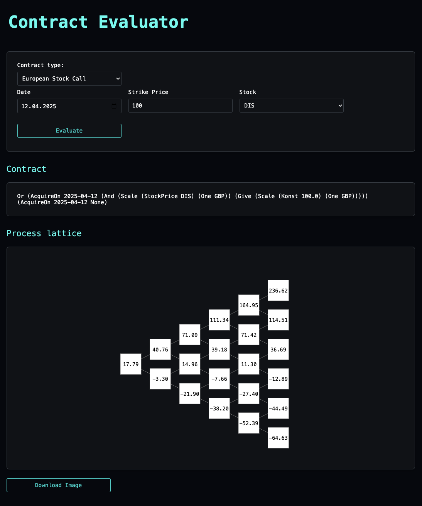

# Financial Contracts eDSL & Valuation


This project implements a user-friendly embedded Domain-Specific Language (eDSL) for representing a wide range of financial contracts in Haskell. The system includes a valuation engine that uses a binomial pricing model to estimate the value of financial contracts.

### Key Features:

- **Backend**: Developed in Haskell, the backend evaluates financial contracts and processes requests from the GUI client. It also generates graphical representations of the resulting valuation lattice for better visualization.
- **GUI Client**: A lightweight frontend for interacting with the backend, built using HTML and CSS.
- **Caching and Optimisation**: Improved performance with caching and an optimisation layer.
- **Testing and Benchmarking**: Includes extensive tests and benchmarks for performance analysis.
- **Error Handling**: Robust error handling for contract evaluation.

## Prerequisites
- GHC (Glasgow Haskell Compiler)
- Cabal (Haskell build tool)
- Dependencies listed in `.cabal` file

## How to Run

### GHCI
```bash
cabal build
cabal repl
```

### Backend
To build and run the backend:
```bash
cabal build
cabal run
```

### GUI Client
To serve the GUI client locally:

1. Navigate to the `gui-client` directory:
   ```bash
   cd gui-client
   ```

2. Start a local HTTP server (e.g., using Python):
   ```bash
   python3 -m http.server 12126
   ```
> **Important:** Use port `12126` because the backend is configured to accept requests only from this port.

3. Open your browser (preferably Chrome) and navigate to:
   ```
   http://localhost:12126/contract-evaluator.html
   ```

> **Important:** Ensure the backend is running before interacting with the GUI client. 

### Example of the GUI Client

Below is an example of the GUI client in action:




## Benchmarking
To run benchmarks:

### Step 1: Configure for benchmarks
echo "benchmarks: True" > cabal.project.local

### Step 2: Build and run benchmarks
```bash
cabal build
cabal bench caching
cabal bench optimasation-layer
```

## Running Tests 
To run tests 
```bash
cabal test
```


## Project goals list:
- [x] test the functions with more contracts 
- [x] add `exchange` valuation function
- [x] add `anytime` combinator for american options
- [x] think about what other observables could exist
- [x] implement stocks and options logic 
- [x] test the functions with invalid contracts 
- [x] custom value process print function
- [x] implement optimisation layer
- [x] implement caching
- [x] implement a contract that requires a Boolean obseravable
- [ ] benchmark caching vs graphs
- [ ] benchmark with without optimisation layer
- [x] create graphical representation of the value process
- [x] update eval error handling
- [x] write more quickCheck property tests 
